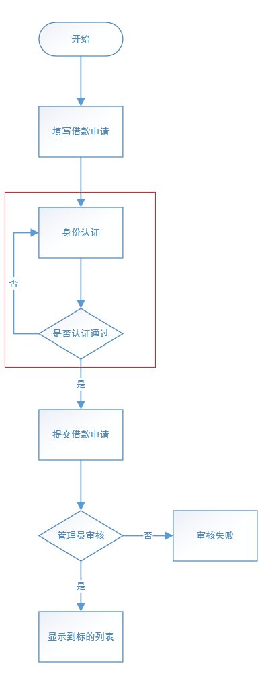
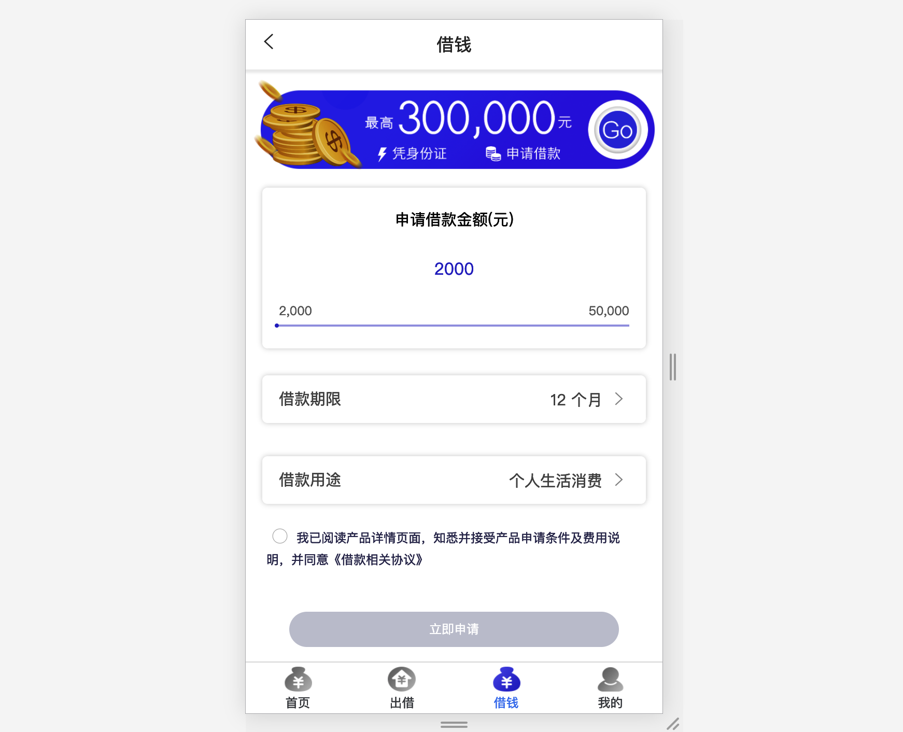
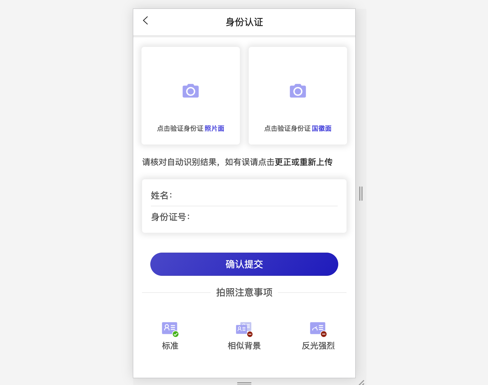
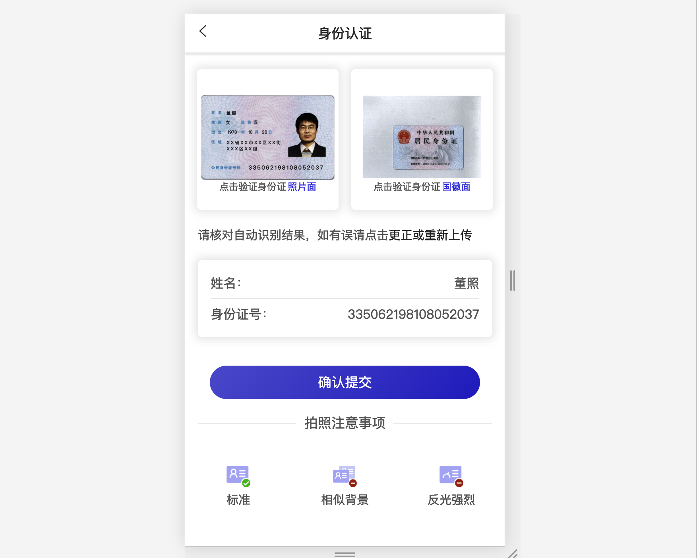
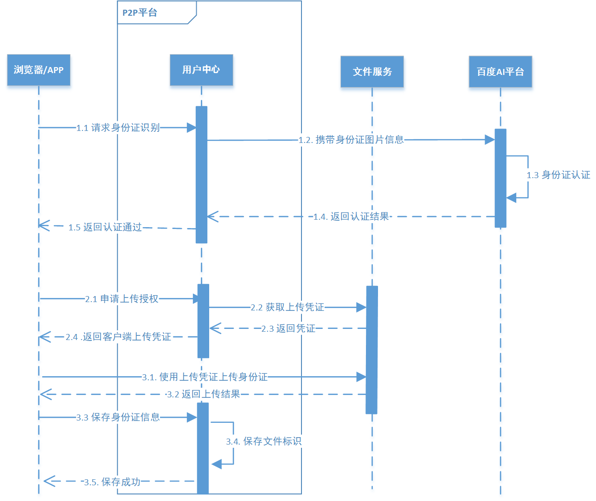
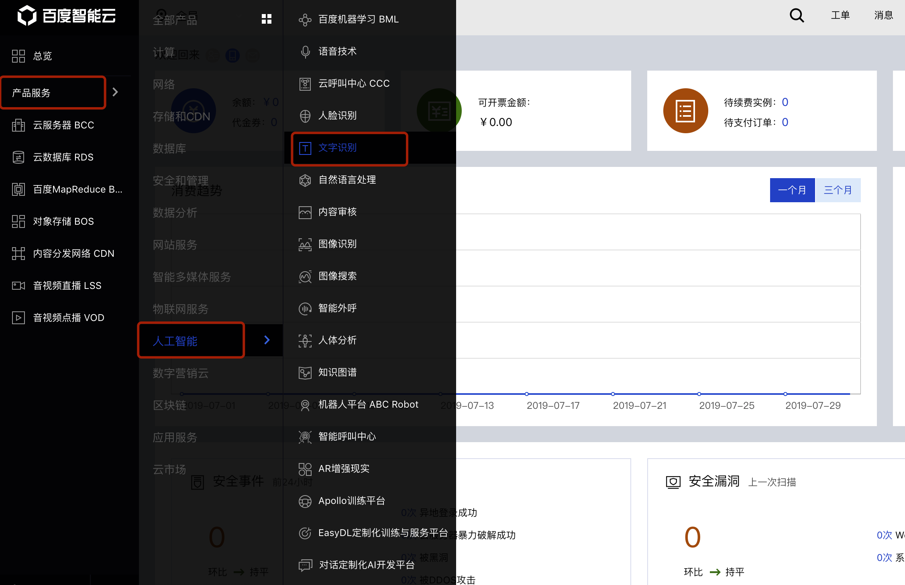
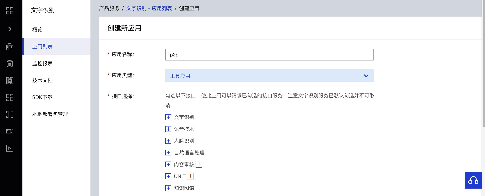
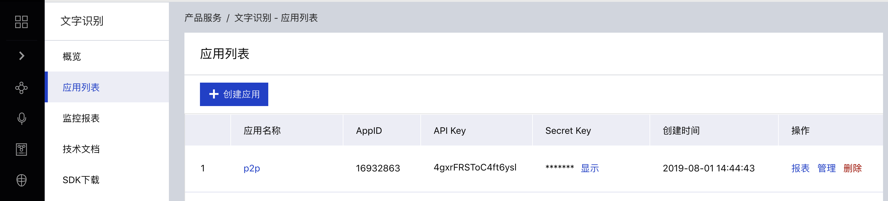
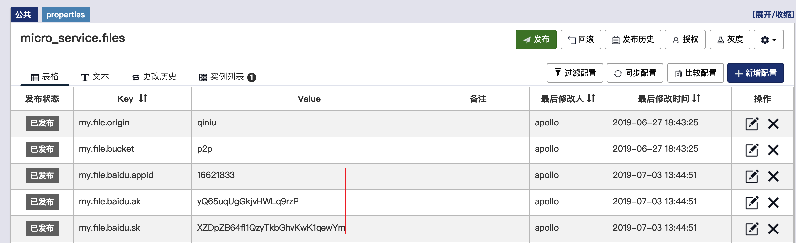

# 万信金融 身份认证 实战

# 1 业务概述

前面在实现开户业务时，系统只是要求用户填写了个人姓名和身份证信息，并没有进行身份认证和校验。这里面就存在着各种风险，例如：假名，盗用他人身份证等等。


特别是对于借款人来说，系统必须对其身份进行认证和校验，否则会对后续交易产生较大风险。系统要么在开户时进行身份认证和校验，要么在发标(交易的第1步)时进行身份认证和校验，考虑到有些用户即使开户也不一定会进行交易(例如：发标)，所以把身份认证和校验放在发标时实现。更新后的发标流程如下：

[]()

1. 填写借款申请



2. 用户上传身份证照片

[]()

3. 提交身份证信息

[]()

4. 申请完毕，等待审核


# 2 需求分析

文件服务是我们抽取出来的专门用于处理文件上传、下载的微服务，可以为万信金融P2P项目的各个业务模块提供文件服务。百度AI是一个第三方开发平台，能够提供各种智能技术，例如：语音识别，图像识别，文字识别等等。

[]()


**第一阶段：识别身份证(图中1.1-1.5)**

1. 前端携带身份证图片信息请求用户中心
2. 用户中心请求百度AI平台进行识别
3. 返回识别结果给前端

**第二阶段：获取上传凭证(图中2.1-2.4)**

1. 前端请求用户中心获取上传授权
2. 用户中心生成上传授权并返回

**第三阶段：上传身份证(图中3.1-3.2)**

1. 前端携带上传凭证和照片请求文件服务，文件服务保存照片到七牛云上
2. 返回上传结果给前端

**第四阶段：保存身份证信息(图中3.3-3.5)**

1. 前端请求用户中心保存身份证信息
2. 用户中心保存身份证照片标识等
3. 返回前端保存成功

# 3 部署文件服务

## 3.1 服务部署

 参考“文件服务部署指南.pdf”

## 3.2 接口说明

farming项目作为独立的文件服务，已经实现了文件上传和下载，我们直接使用即可。要了解相关接口，可以访问：http://localhost:56082/farming/swagger-ui.html，也可以直接查看项目源码。

# 4 使用百度AI服务

## 4.1 注册并登录百度AI

访问https://login.bce.baidu.com，自行注册并登录(可以尝试短信验证码快捷登录)

## 4.2 相关设置

1. 选择文字识别服务

[]()

2. 创建应用


3. 填写应用名称和类型，提交请求

[]()

4. 获取AppID, API Key和Secret Key

[]()

## 4.3 使用百度AI

1. 在用户中心(consumer-service)的pom文件中引入百度AI：

```xml
<!--百度AI-->
<dependency>
   <groupId>com.baidu.aip</groupId>
   <artifactId>java-sdk</artifactId>
   <version>4.8.0</version>
</dependency>
```

2. 登录Apollo，找到consumer-service项目, 在**micro_service.files**中增加如下配置：

[]()


# 5 接口定义

## 5.1 第一阶段：识别身份证

用户中心请求百度AI识别身份证，在用户中心定义识别身份证照片接口：

1、接口描述如下

1）前端提交身份证照片到用户中心

2）用户中心请求百度AI进行身份证识别

3）百度AI返回识别结果给用户中心

4）用户中心响应前端返回识别结果

2、接口定义如下

在ConsumerApi接口中，定义imageRecognition方法：

```java
/**
 * 提交身份证图片给百度AI进行识别
 * @param file 被上传的文件
 * @param flag 身份证正反面  取值front 或 back
 * @return Map集合 识别成功后把身份证上的姓名和身份证号存到map中返回
 */
RestResponse<Map<String, String>> imageRecognition(MultipartFile file, String flag);
```

在ConsumerController类中实现该方法:

```java
@Override
@ApiOperation("提交身份证图片给百度AI进行识别")
@PostMapping("/my/imageRecognition")
public RestResponse<Map<String,String>> imageRecognition(
    										@RequestParam("file")MultipartFile file,
                                            String flag) {
    return null;
}
```

> 功能实现：请参考百度AI官方文档：https://ai.baidu.com/docs#/OCR-Java-SDK/top


## 5.2 第二阶段：获取上传凭证

要想通过文件服务上传文件，必须获得上传凭证。在用户中心定义获取上传凭证接口：

1、接口描述如下

1）向文件服务请求获取上传凭证

2）响应前端返回凭证

2、接口定义如下

在ConsumerApi接口中，定义applyUploadCertificate方法：

```java
/**
 * 申请获得上传凭证
 * @return
 */
RestResponse<String> applyUploadCertificate();
```

在ConsumerController类中实现该方法：

```java
@Override
@ApiOperation("申请获得上传凭证")
@GetMapping("/my/applyUploadCertificate")
public RestResponse<String> applyUploadCertificate(){
    return null;
}
```

> 功能实现：请参考文件服务farming中的TokenController，需要通过RestTemplate或OkHttpClient往这里发请求。


## 5.3 第三阶段：上传身份证

前端携带之前获得的上传凭证，请求文件服务上传身份证照片，由于上传功能已经在文件服务中实现，所以这里只需要对前端做出调整(开启身份认证界面)即可：找到资料文件夹中的borrow.vue文件，然后用它把前端工程中的该文件替换掉。


## 5.4 第四阶段：保存身份证信息

文件上传成功后，前端会接收到文件服务返回的结果和文件标识，然后前端携带这些数据请求用户中心保存身份证信息。

在用户中心定义保存身份证信息接口：

1、接口描述

1）接受前端提交的身份证信息

2）用户中心校验身份证信息是否和之前开户信息一致

3）用户中心保存身份证照片标识

4）返回结果给前端

2、接口定义

在ConsumerApi接口中，定义saveConsumerDetails方法：

```java
/**
 * 保存用户详细信息(主要存储身份证文件标识)
 * @param consumerDetailsDTO 封装用户详情信息
 * @return
 */
RestResponse<String> saveConsumerDetails(ConsumerDetailsDTO consumerDetailsDTO);
```

在ConsumerController类中实现该方法：

```java
@Override
@ApiOperation(value="保存用户详细信息", notes="主要存储身份证文件标识")
@ApiImplicitParams({
        @ApiImplicitParam(name = "consumerDetailsDTO", value = "用户详细信息", dataType = "ConsumerDetailsDTO", paramType = "body")})
@PostMapping("/my/saveConsumerDetails")
public RestResponse<String> saveConsumerDetails(@RequestBody ConsumerDetailsDTO consumerDetailsDTO){
    //... ...
    return RestResponse.success("保存成功");
}
```

> 该阶段涉及到新的类有：ConsumerDetailsDTO、ConsumerDetails、ConsumerDetailsService、ConsumerDetailsServiceImpl、ConsumerDetailsMapper