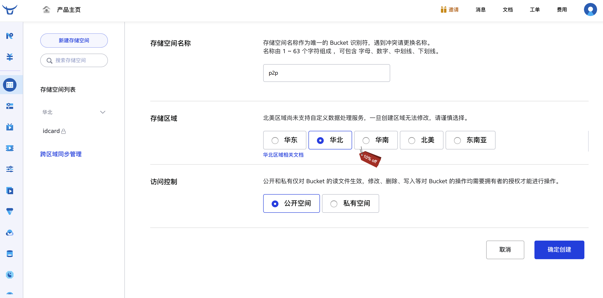
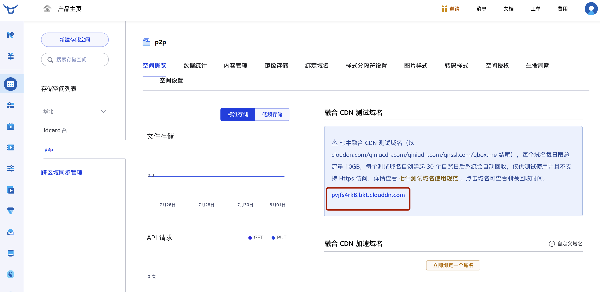
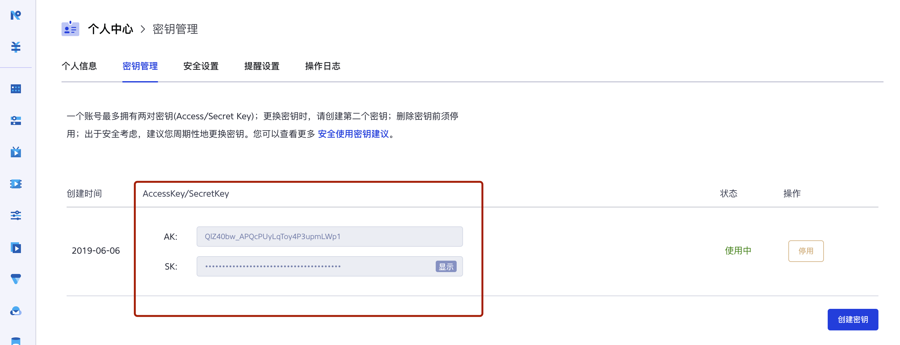
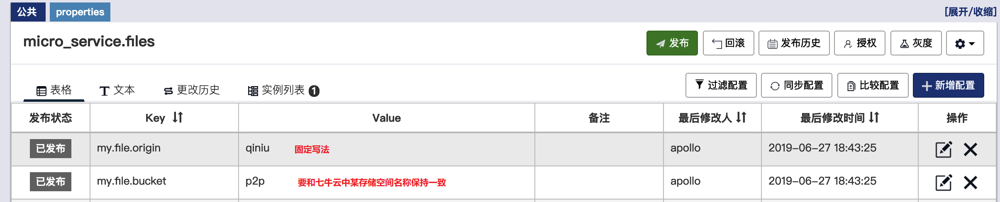

# 文件服务使用指南

文件服务是我们抽取出来的专门用于处理文件上传、下载的微服务，可以为万信金融P2P项目的各个业务模块提供文件服务。该服务默认采用七牛云作为文件存储源，将来也会和百度云、阿里云做对接，成为一个通用的、独立的文件微服务。

# 1 环境搭建

## 1.1 基础环境

 Java 1.8+、MySQL 5.6.5+

## 1.2 初始化数据库

 执行如下sql语句：

```sql
SET NAMES utf8mb4;
SET FOREIGN_KEY_CHECKS = 0;

CREATE DATABASE `p2p_file` CHARACTER SET 'utf8' COLLATE 'utf8_general_ci';

Use p2p_file;

DROP TABLE IF EXISTS `fileobject`;
CREATE TABLE `fileobject` (
  `ID` bigint(20) NOT NULL AUTO_INCREMENT COMMENT '主键',
  `fileName` varchar(50) DEFAULT NULL COMMENT '原文件名',
  `origin` varchar(20) NOT NULL COMMENT '存储源',
  `resourceKey` varchar(100) NOT NULL COMMENT '文件key',
  `flag` varchar(10) NOT NULL COMMENT '正反面',
  `downloadUrl` varchar(200) DEFAULT NULL COMMENT '文件下载地址',
  `isProtect` tinyint(1) NOT NULL COMMENT '公有还是私有',
  `uploaddate` datetime NOT NULL COMMENT '上传日期',
  PRIMARY KEY (`ID`)
) ENGINE=InnoDB DEFAULT CHARSET=utf8;

SET FOREIGN_KEY_CHECKS = 1;
```

# 2 部署文件服务

## 2.1 下载源码

```
git clone https://github.com/fightingape/farming.git
```

## 2.2  使用IDEA打开项目

[]()

## 2.3 修改配置(数据库)


由于在上传文件时，需要把文件信息保存到fileobject表中，因此需要修改数据库相关配置。

## 2.4 注册七牛云对象存储服务

本项目默认使用七牛云(对象存储服务)来存储文件，需要自行注册并登录：https://www.qiniu.com/products/kodo。登录到个人控制台后，需要点击左侧菜单中的“对象存储”进行一系列设置。

1. 新建存储空间

[]()

2. 创建成功，获取融合 CDN 测试域名

[]()

3. 获取七牛云服务秘钥


[]()

## 2.5 修改配置(文件存储)


Java代码是现成的，已经把功能实现过了，我们只需要搞定配置即可。


# 3 使用文件服务

在上传文件之前，需要申请上传凭证，Java代码中需要知道你的存储源和存储空间名字。登录Apollo，找到consumer-service项目, 创建名称空间：**micro_service.files**，并进行如下配置：

[]()

将来文件上传成功后，在内容管理中可以看到该文件，如下图所示。红框中的文件名是每个文件的唯一标识，会返回给用户中心保存到p2p_consumer数据库的consumer_details表中。

